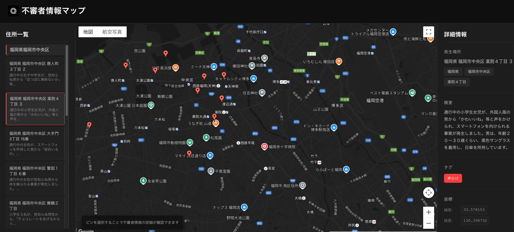
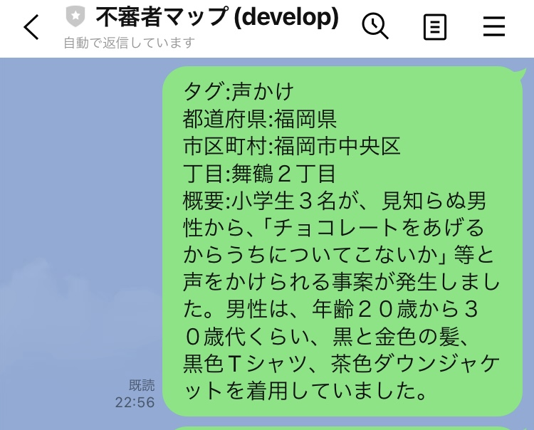

# 不審者情報マップ 🗺️

LINEメッセージで共有された不審者情報を地図上に可視化する Web アプリケーションです。  
※処理イメージ：LINE MessagingAPI → Geocoding API → DB登録 → データ取得し画面表示

---

## 🔍 概要

- Google Maps を利用した地図表示
- 不審者情報をピンで表示
- ピンをクリックすると詳細情報を確認可能

---

## 🛠 使用技術

### フロントエンド
- React
- Vite
- JavaScript
- CSS

### バックエンド
- Java
- Spring Boot
- LINE Messaging API
- Google Maps Geocoding API

### データベース
- PostgreSQL

### インフラ・その他
- GitHub
- Docker
- Cursor Editer

## 📌 注意事項
- Google Maps API Keyが必要です。

## その他
- LINE Developersにて、アカウントを作成

- テンプレートに沿って不審者情報を送信する

