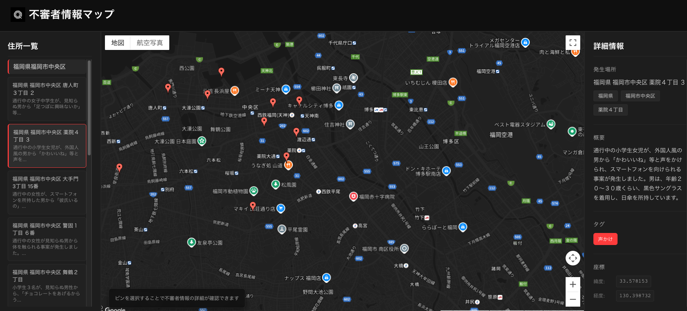
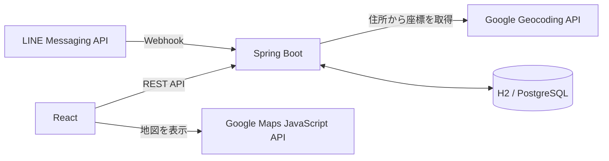
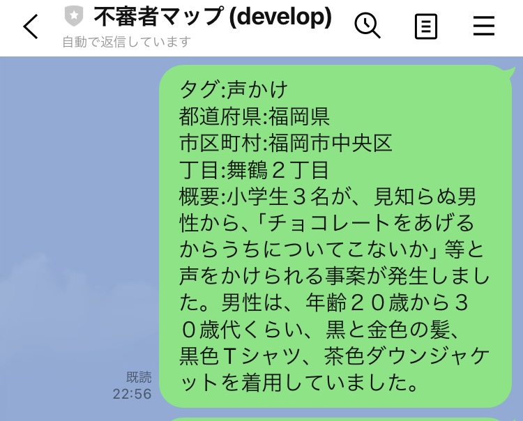

# 不審者情報マップ

LINE から受信した不審者情報を住所解析・Geocoding して保存し、Google Maps 上に表示する Web アプリケーションです。



## 主な機能

- LINE のテキストメッセージから発生日時、住所、タグ、概要を抽出
- Google Geocoding API で住所を緯度・経度へ変換
- 不審者情報をデータベースに保存
- 保存された情報を Google Maps 上にマーカーとして表示
- 住所一覧またはマーカーから報告の詳細を表示

## 工夫した点

### 住所表記の違いを考慮した Geocoding

日本語住所は、人間には同じ意味に見えても表記形式によって Geocoding API の結果が変わります。開発当初は `3丁目15` を `3-15` のように機械的に変換したことで `ZERO_RESULTS` になったり、`partial_match=true` や `types=route` の意図しない地点が返ったりしました。

そこで、日本語として意味のある「丁目」などを残しながら表記を整え、詳細住所で取得できない場合は、都道府県・市区町村・丁目を維持したまま番地以降を右側から段階的に短くして再検索するようにしました。また、API が返した候補を順に確認し、`partial_match=true` の候補と、`types` に `route` を含む候補を除外しています。

これにより、詳細住所で取得できない場合も、道路として解釈された候補や部分一致の候補を避けながら、入力された必須住所部分の範囲内で座標を取得できる構成にしました。設計と精度上の制約は [`docs/integrations/google-maps.md`](docs/integrations/google-maps.md) を参照してください。

### LINE Messaging API との Webhook 連携

LINE から受信したメッセージをアプリケーションへ取り込むため、Spring Boot に Webhook エンドポイントを実装しました。接続検証では、ngrok を使ってバックエンドの `localhost:8080` を HTTPS で外部公開し、LINE Platform からのリクエストを受信しました。

開発当初は LINE Bot SDK による Webhook の自動受付を試しましたが、当時の環境ではエンドポイントのマッピングを確認できず、処理経路の切り分けが難しい状態でした。そこで、現在は `POST /line/callback` を Controller で明示し、生のリクエストボディの署名を検証してから Jackson で解析し、メッセージの解析と保存を Service に委譲しています。これにより、HTTP 受信から保存までの責務と処理経路をコード上で追えるようにしました。

詳しい構成は [`docs/integrations/line-messaging-api.md`](docs/integrations/line-messaging-api.md)、障害の確認方法は [`docs/operations/troubleshooting.md`](docs/operations/troubleshooting.md) を参照してください。

## システム構成


```mermaid
flowchart LR
    line[LINE Messaging API] -->|Webhook| backend[Spring Boot]
    backend -->|住所から座標を取得| geocoding[Google Geocoding API]
    backend <--> db[(H2 / PostgreSQL)]
    frontend[React] -->|REST API| backend
    frontend -->|地図を表示| maps[Google Maps JavaScript API]
```

## 使用技術

| 分類             | 技術                                                          |
| ---------------- | ------------------------------------------------------------- |
| フロントエンド   | React 19、Vite 7、JavaScript、CSS、Google Maps JavaScript API |
| バックエンド     | Java 17、Spring Boot 3.5、Spring Data JPA                     |
| データベース     | PostgreSQL、H2（ローカル・自動テスト）                       |
| 外部連携         | LINE Messaging API、Google Geocoding API                      |
| ビルド・品質管理 | Maven Wrapper、npm、ESLint                                    |

## 必要な環境

- Java 17
- Node.js 20.19 以上または 22.12 以上（Vite 7 の要件）
- PostgreSQL（PostgreSQL 互換性をローカルで確認する場合）
- ngrok（LINE Webhook をローカル環境で確認する場合）
- Google Maps JavaScript API と Geocoding API を有効化した Google Maps Platform の API キー

Google Maps JavaScript API と Geocoding API には、用途ごとに適切な制限を設定した別々の API キーを使用することを推奨します。

## クイックスタート

### 1. バックエンドを設定する

ローカルの認証情報は、Git 管理対象外の `backend/config/application-local-secrets.properties` に集約します。既存環境では移行済みのファイルを使用し、新しい環境では既存ファイルをコピーして配置してください。認証情報の実値はコミットしないでください。

```properties
local.google.geocoding-api-key=YOUR_GOOGLE_GEOCODING_API_KEY
local.line.channel-secret=YOUR_LINE_CHANNEL_SECRET
local.cors.allowed-origins=http://localhost:5173

local.postgres.datasource.url=jdbc:postgresql://localhost:5432/personal_develop_db
local.postgres.datasource.username=YOUR_DATABASE_USER
local.postgres.datasource.password=YOUR_DATABASE_PASSWORD
```

通常の動作確認では、ファイル型 H2 を使用する `local-h2` Profile でバックエンドを起動します。登録データは `backend/.local-data/` に残り、Docker と PostgreSQL コンテナは不要です。

```bash
cd backend
SPRING_PROFILES_ACTIVE=local-h2 ./mvnw spring-boot:run
```

標準設定では `http://localhost:8080` で起動します。

Entity、Repository、DB 制約などを変更したときは、PostgreSQL コンテナを起動し、`local-postgres` Profile で互換性を確認します。設定した URL と一致するデータベースを事前に作成してください。

```bash
SPRING_PROFILES_ACTIVE=local-postgres ./mvnw spring-boot:run
```

`prod` Profile は未使用の本番用設定として存在し、認証情報をデプロイ環境の環境変数から受け取る構造です。本番の接続先と運用基盤は未決定です。Profileの使い分け、H2の保存先、現在のDockerコンテナ、認証情報の管理方針は [`docs/development/database.md`](docs/development/database.md) を参照してください。

### 2. フロントエンドを設定する

Git 管理対象外の `frontend/.env.development` に、ローカル環境の値を設定します。

```dotenv
VITE_API_BASE_URL=http://localhost:8080
VITE_GOOGLE_MAPS_API_KEY=YOUR_GOOGLE_MAPS_JAVASCRIPT_API_KEY
```

依存関係をインストールして起動します。

```bash
cd frontend
npm ci
npm run dev
```

ブラウザで `http://localhost:5173` を開きます。フロントエンドは `VITE_API_BASE_URL` に設定した REST API へ接続します。

### 3. LINE Webhook を設定する

`LineController` は、受信したリクエスト本文と `X-Line-Signature` をチャネルシークレットで検証します。署名がない、または一致しないリクエストは、JSON 解析、Geocoding、データベース保存より前に `400 Bad Request` で拒否します。

Spring Boot を起動したまま、別のターミナルで ngrok を起動します。

```bash
ngrok http 8080
```

Spring Boot の `8080` 番ポートを HTTPS で公開し、LINE Developers の Webhook URL に次のパスを設定します。

```text
https://YOUR_PUBLIC_HOST/line/callback
```

React の開発サーバーが使用する `5173` 番ポートではなく、Webhook を受信する Spring Boot の `8080` 番ポートを公開します。ローカル接続時の構成は [`docs/integrations/line-messaging-api.md`](docs/integrations/line-messaging-api.md) を参照してください。

メッセージは次の形式で送信します。

```text
タグ: 不審な声かけ、つきまとい
日時: 2025年1月1日午後6時30分
都道府県: 福岡県
市区町村: 福岡市中央区
丁目: 天神1丁目
番地以降: 1-1
概要: 通行人への不審な声かけ
```



## API

| メソッド | パス             | 用途                                     |
| -------- | ---------------- | ---------------------------------------- |
| `POST`   | `/line/callback` | LINE の Webhook を受信して報告を登録する |
| `GET`    | `/api/reports`   | 登録済みの報告一覧を取得する             |

## 検証

```bash
cd frontend
npm run lint
npm run build
```

```bash
cd backend
./mvnw test
```

## ドキュメント

- [`docs/architecture/system-overview.md`](docs/architecture/system-overview.md): システム構成、コンポーネントの責務、登録・閲覧データフロー
- [`docs/development/database.md`](docs/development/database.md): DB Profile、H2、Docker PostgreSQL、本番用設定の現状
- [`docs/development/configuration-management.md`](docs/development/configuration-management.md): 環境別設定、秘密情報、Git 管理区分の方針
- [`docs/integrations/line-messaging-api.md`](docs/integrations/line-messaging-api.md): LINE Webhook の構成、開発手順、セキュリティ方針
- [`docs/integrations/google-maps.md`](docs/integrations/google-maps.md): Google Maps・Geocoding 連携の設計、実装、精度上の制約
- [`docs/operations/troubleshooting.md`](docs/operations/troubleshooting.md): 開発・連携時の問題の切り分け方法
