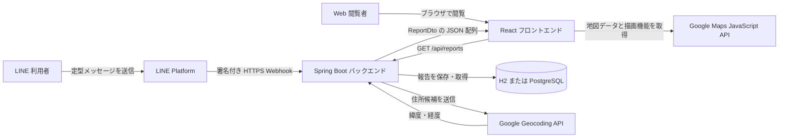
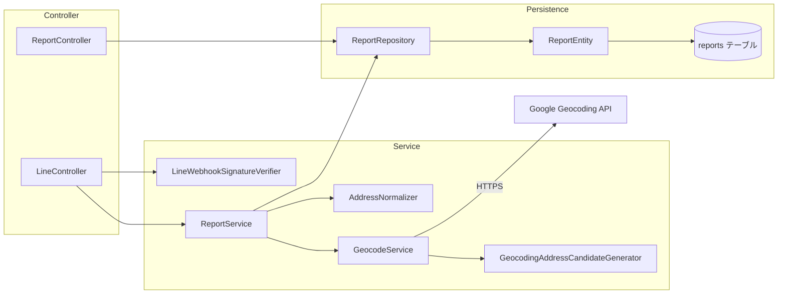
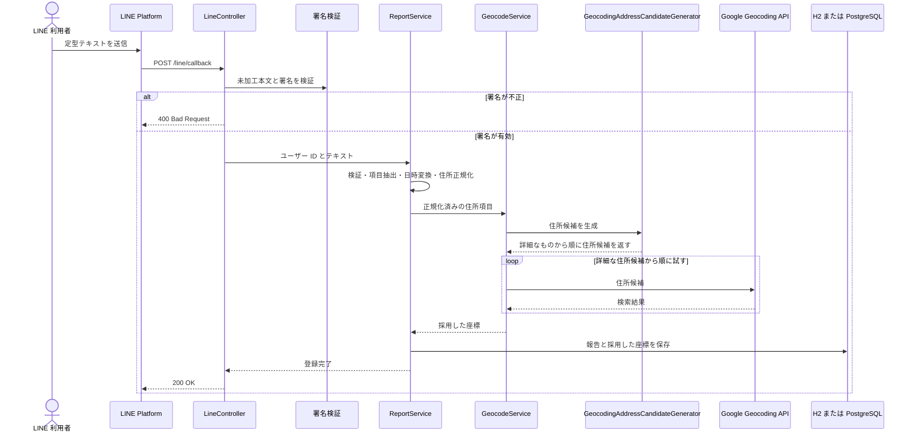
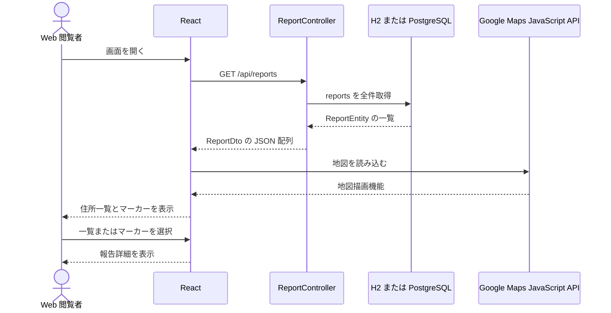
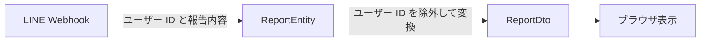

# システム全体像

## 目的

この文書は、不審者情報マップを構成するアプリケーション、外部サービス、データベースの関係と、情報の登録から画面表示までの主要な流れを俯瞰するための入口である。

セットアップ手順や個別連携の詳細はここへ重複して記載せず、末尾の[関連文書](#関連文書)を正本として参照する。

## システムの役割と範囲

本システムは、LINE の定型テキストから不審者情報を取り込み、住所を座標へ変換して保存し、Web 画面の一覧・地図・詳細欄へ表示する。

現在の実装が担当する範囲は次のとおりである。

- LINE Webhook の受信元を署名で検証する
- メッセージからタグ、発生日時、住所、概要を抽出する
- 住所表記を正規化し、Google Geocoding API から緯度・経度を取得する
- 報告と座標をデータベースへ保存する
- 保存済み報告を画面表示用 DTO として提供する
- 報告を住所一覧、Google Maps のマーカー、詳細欄へ表示する

ユーザー管理、報告の更新・削除、管理画面、通知、公開環境へのデプロイは現在の実装範囲に含まれない。本番の接続先と運用基盤も未決定である。

## システムコンテキスト

LINE Platform と Google の各 API はシステム外部のサービスである。H2 と PostgreSQL は同時に使用せず、Spring Profile によって切り替える。ローカルで LINE Webhook を確認するときは ngrok を LINE Platform とバックエンドの間に置くが、これは開発時の接続手段であり、本番構成ではない。

## アプリケーション構成

### バックエンド

バックエンドは Spring Boot の単一アプリケーションであり、HTTP 入出力、業務処理、外部 API 連携、永続化をレイヤーごとに分けている。

| コンポーネント | 主な責務 |
| --- | --- |
| `LineController` | `POST /line/callback` を受信し、署名検証後に Webhook JSON からユーザー ID とテキストを取り出す |
| `LineWebhookSignatureVerifier` | 未加工のリクエスト本文と `X-Line-Signature` をチャネルシークレットで検証する |
| `ReportService` | 入力検証、メッセージ解析、日時変換、住所正規化、Geocoding、Entity 生成、保存を一つのトランザクションで調整する |
| `AddressNormalizer` | 住所項目の Unicode・空白・数字間の区切り表記を正規化する |
| `GeocodingAddressCandidateGenerator` | 必須の住所部分を保ったまま、詳細なものから順に Geocoding 用候補を生成する |
| `GeocodeService` | Google Geocoding API を呼び、部分一致や道路として解釈された候補を除外して座標を返す |
| `ReportRepository` | Spring Data JPA を介して `reports` テーブルを読み書きする |
| `ReportController` | `GET /api/reports` で Entity を画面表示用 `ReportDto` に変換して返す |

`ReportController` は現在 Service を介さず `ReportRepository` を直接参照している。これは現状の読み取り処理が全件取得と DTO 変換だけで構成されているためである。

### フロントエンド

フロントエンドは React の単一ページアプリケーションである。初回表示時に報告一覧を取得し、同じ報告オブジェクトを一覧、地図、詳細欄で共有する。

| コンポーネント | 主な責務 |
| --- | --- |
| `App` | 報告一覧、選択中の報告、読み込み状態を管理し、画面の 3 領域を構成する |
| `services/api.js` | `VITE_API_BASE_URL` を基準にバックエンドの報告取得 API を呼び出す |
| `AddressList` | 報告を都道府県と市区町村でグループ化し、選択可能な住所一覧として表示する |
| `MapView` | Maps JavaScript API を読み込み、座標を持つ報告をマーカーとして表示する |
| `ReportDetail` | 選択された報告の発生日時、住所、概要、タグを表示する |

住所一覧とマーカーのどちらから報告を選択しても、`App` の同じ選択状態が更新され、詳細欄と選択中マーカーの表示へ反映される。フロントエンドは報告の登録処理を行わない。

## 主要なデータフロー

### 1. LINE から報告を登録する

登録処理は Webhook リクエスト内で同期的に実行される。Geocoding で有効な座標を得られない場合や保存に失敗した場合は `ReportProcessingException` として処理され、報告は保存されず、Webhook へ `500 Internal Server Error` を返す。

`ReportService.processReportMessage` には `@Transactional` が付いている。現在の処理順は Geocoding の完了後に 1 件を保存するため、外部 API の呼び出し結果とデータベース保存が別々の報告として残る構成ではない。ただし、外部の Geocoding API 自体はデータベーストランザクションの対象外である。

### 2. 保存済み報告を閲覧する

API は現在、保存済み報告をページングや検索条件なしで全件返す。フロントエンドは取得したデータをブラウザ内で住所別にグループ化し、緯度・経度を持つ報告だけを地図へ描画する。

## データと公開範囲

`reports` テーブルには、登録元の LINE ユーザー ID、最大 3 件のタグ、発生日時、住所の構成要素、緯度・経度、概要、登録日時を保存する。

LINE ユーザー ID は保存には使用するが、`ReportDto` に含めないため `GET /api/reports` のレスポンスには公開されない。一方、住所、座標、発生日時、概要は画面表示のため API で返される機微な情報である。

現在、報告取得 API にアプリケーション独自の認証・認可は実装されていない。公開範囲を決める際は、住所と座標の粒度を含めて別途判断する必要がある。

## 実行環境と設定境界

| 実行用途 | フロントエンド | バックエンド | データベース |
| --- | --- | --- | --- |
| 通常のローカル確認 | Vite 開発サーバー（標準 `:5173`） | `local-h2` Profile（標準 `:8080`） | ファイル型 H2 |
| PostgreSQL 互換性確認 | Vite 開発サーバー | `local-postgres` Profile | ローカル PostgreSQL 15 |
| 自動テスト | 対象外 | `test` Profile | インメモリ H2 |
| 本番用設定 | 構成未決定 | `prod` Profile は設定のみ存在 | 接続先未決定 |

バックエンドは Profile によりデータベースと設定元を切り替える。ローカルの認証情報は Git 管理対象外ファイルまたは環境変数、本番用設定は環境変数から受け取る。フロントエンドはビルド時・起動時の Vite 環境変数から API の接続先と Maps JavaScript API キーを受け取る。

H2 は日常的な動作確認と自動テストを容易にするために使用し、実行環境の主要データベースは PostgreSQL を想定して互換性を確認する。H2 の PostgreSQL 互換モードは完全互換ではないため、DB 関連変更は PostgreSQL でも確認する。

## セキュリティとプライバシーの境界

- LINE Webhook は、JSON 解析や保存より前に未加工の本文で署名を検証する。
- API キー、チャネルシークレット、DB パスワードはソースコードや Git 管理対象ファイルへ保存しない。
- CORS は `/api/**` に対し、環境別に設定した Origin のみを許可する。
- LINE ユーザー ID は画面表示用 DTO から除外する。
- リクエスト本文、署名、ユーザー ID、完全な住所、座標は機微な情報として扱う。
- Geocoding API キーを含み得る完全なリクエスト URLをログへ出力しない。

ログに含める情報の制限には未対応箇所が残っている。

## 現在の主な制約

- 報告登録は LINE の定型メッセージだけを入口とし、Web 画面からは登録できない。
- Webhook 内で Geocoding と保存を同期実行するため、外部 API の応答時間や障害が Webhook の処理結果へ直接影響する。
- 報告取得 API は全件取得のみで、ページング、期間・地域による絞り込み、並び順の明示指定はない。
- 住所を短縮した候補で取得した座標は、入力された詳細住所そのものを示すとは限らない。採用した候補や座標精度は保存していない。
- DB スキーマはローカルでは Hibernate の自動更新に依存し、再現可能なマイグレーション管理は未導入である。
- フロントエンドには自動テストがなく、画面の読み込み失敗状態も限定的な扱いである。

この概要文書では、改善候補を現在の仕様として扱わない。

## コードを読む順序

登録処理を追う場合は、次の順序で読むと境界を把握しやすい。

1. [`../../backend/src/main/java/suspiciouspersonmap/controller/LineController.java`](../../backend/src/main/java/suspiciouspersonmap/controller/LineController.java)
2. [`../../backend/src/main/java/suspiciouspersonmap/service/LineWebhookSignatureVerifier.java`](../../backend/src/main/java/suspiciouspersonmap/service/LineWebhookSignatureVerifier.java)
3. [`../../backend/src/main/java/suspiciouspersonmap/service/ReportService.java`](../../backend/src/main/java/suspiciouspersonmap/service/ReportService.java)
4. [`../../backend/src/main/java/suspiciouspersonmap/service/AddressNormalizer.java`](../../backend/src/main/java/suspiciouspersonmap/service/AddressNormalizer.java)
5. [`../../backend/src/main/java/suspiciouspersonmap/service/GeocodingAddressCandidateGenerator.java`](../../backend/src/main/java/suspiciouspersonmap/service/GeocodingAddressCandidateGenerator.java)
6. [`../../backend/src/main/java/suspiciouspersonmap/service/GeocodeService.java`](../../backend/src/main/java/suspiciouspersonmap/service/GeocodeService.java)
7. [`../../backend/src/main/java/suspiciouspersonmap/entity/ReportEntity.java`](../../backend/src/main/java/suspiciouspersonmap/entity/ReportEntity.java)

閲覧処理を追う場合は、次の順序で読む。

1. [`../../backend/src/main/java/suspiciouspersonmap/controller/ReportController.java`](../../backend/src/main/java/suspiciouspersonmap/controller/ReportController.java)
2. [`../../backend/src/main/java/suspiciouspersonmap/dto/ReportDto.java`](../../backend/src/main/java/suspiciouspersonmap/dto/ReportDto.java)
3. [`../../frontend/src/services/api.js`](../../frontend/src/services/api.js)
4. [`../../frontend/src/App.jsx`](../../frontend/src/App.jsx)
5. [`../../frontend/src/components/AddressList.jsx`](../../frontend/src/components/AddressList.jsx)
6. [`../../frontend/src/components/MapView.jsx`](../../frontend/src/components/MapView.jsx)
7. [`../../frontend/src/components/ReportDetail.jsx`](../../frontend/src/components/ReportDetail.jsx)

## 関連文書

- [`../../README.md`](../../README.md): 概要、クイックスタート、API の入口
- [`../development/database.md`](../development/database.md): DB Profile、保存先、PostgreSQL 互換性確認
- [`../development/configuration-management.md`](../development/configuration-management.md): 設定ファイル、環境変数、秘密情報の管理
- [`../integrations/line-messaging-api.md`](../integrations/line-messaging-api.md): Webhook 接続、署名検証、ローカル確認
- [`../integrations/google-maps.md`](../integrations/google-maps.md): 住所正規化、Geocoding 候補、座標の採用条件と精度
- [`../operations/troubleshooting.md`](../operations/troubleshooting.md): LINE、Geocoding、DB、CORS の問題の切り分け
