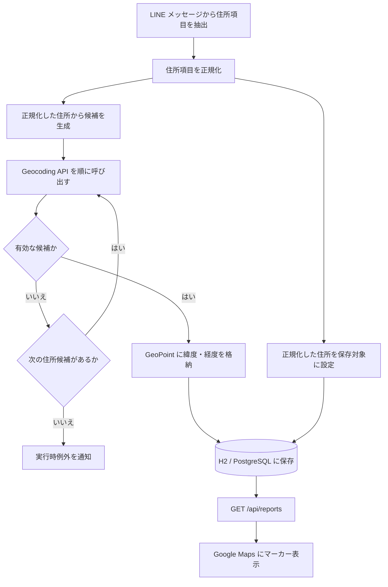

# Google Maps・Geocoding API 連携

## 1. 背景・目的

LINE から受信した不審者情報には住所が含まれるが、Google Maps 上にマーカーを表示するには緯度・経度が必要である。そのため、バックエンドで住所を Google Geocoding API へ送信し、取得した座標をデータベースへ保存している。ローカルの通常検証では H2、PostgreSQL 互換性確認ではローカル PostgreSQL を使用し、フロントエンドは保存済みの座標を Google Maps JavaScript API で表示する。本番の接続先は未決定である。

現在の実装は、詳細住所で座標を取得できない場合に住所を短くして再検索する。どの住所候補で取得した座標かは保存していないため、現在の動作と精度上の制約をこの文書に記載する。

## 2. 処理フロー



住所候補は、LINE メッセージから抽出した都道府県、市区町村、丁目欄、番地以降の構造を維持して生成する。都道府県、市区町村、丁目欄を結合した住所を必須住所部分とし、これより粗い候補は生成しない。

1. 必須住所部分と正規化した番地以降を結合した住所
2. 番地以降が `-数字` で終わる間、末尾の数値区切りを一つずつ除いた住所
3. 番地以降を除いた必須住所部分

例えば、番地以降が `3番地4` の場合は、正規化後の`3-4`、`3`、番地以降なしの順で試す。`1-2-3` の場合は、`1-2-3`、`1-2`、`1`、番地以降なしの順となる。番地以降が入力されていない場合は、必須住所部分だけを試す。先に有効な座標を取得できた候補を採用し、すべて失敗した場合は丁目欄を削った粗い住所へ検索範囲を広げず登録を中止する。

LINE メッセージから抽出した各住所構成要素は、Geocoding の候補生成前に正規化する。正規化した値は Geocoding とデータベース保存の両方で使用するため、保存する住所についても同じ表記へ統一される。

各住所構成要素には次の正規化を適用する。

- NFKC により、住所の各項目に含まれる全角数字 `０`～`９`を半角数字 `0`～`9`へ統一し、全角英字と半角カナなどの互換文字も統一する
- Unicode の空白文字を除去する
- 数字に挟まれたハイフン類と長音 `ー` を半角の `-` へ統一する
- 数字に挟まれた `番`と`番地`を半角の `-` へ統一する
- `丁目` や、`センター`などの語中にある長音 `ー` は別の文字へ変換しない

`番`と`番地`の変換は数字に挟まれた場合だけに限定し、地名の`一番町`、`三番町`や建物名の`3番館`などは維持する。正規化後の住所はGeocodingとデータベース保存の両方で使用する。Geocodingの候補生成時に番地以降の末尾にある余分な`-`を除去する処理だけは、データベースへ保存する住所には適用しない。

長音 `ー` は、`センター`、`タワー`、`パーク`など、番地以降に入力され得る建物名・施設名の一部として使用される。このため、すべての `ー` を半角ハイフンへ置換すると固有名詞を壊し、Geocoding API が住所を解釈しにくくなる可能性がある。一方、利用者が番地の区切りとして `1ー2` のように入力する表記揺れは吸収したい。そのため、`ー` は数字に挟まれている場合だけ `-` へ変換し、語中では元の文字を維持する。

```text
1ー2                    -> 1-2
パークコートタワー101  -> パークコートタワー101
```

同様に、`丁目`は住所構造を示す文字列として Google Geocoding API が解釈できるため、機械的にハイフンへ置き換えない。

## 3. API リクエスト仕様

バックエンドは、現在次のエンドポイントとクエリパラメーターを使用している。

```text
GET https://maps.googleapis.com/maps/api/geocode/json
```

| パラメーター | 値                        | 用途                                           |
| ------------ | ------------------------- | ---------------------------------------------- |
| `address`    | 検索する住所              | 座標へ変換する住所を指定する                   |
| `language`   | `ja`                      | 日本語のレスポンスを要求する                   |
| `region`     | `jp`                      | 日本の検索結果を優先するためのバイアスを与える |
| `key`        | `google.api.key` の設定値 | Geocoding API の認証に使用する                 |

`region=jp` は検索結果を日本へ限定する条件ではない。現在の実装は `components` パラメーターを使用していない。リクエストパラメーターの意味は Google の [Geocoding request and response](https://developers.google.com/maps/documentation/geocoding/guides-v3/requests-geocoding) を正本とする。

開発用 API キーはソースコードへ直接記載せず、Git 管理対象外の `backend/config/application-local-secrets.properties` に `local.google.geocoding-api-key` として設定する。`local-h2` と `local-postgres` の各Profileがこれを `google.api.key` へ割り当て、環境変数 `GOOGLE_GEOCODING_API_KEY` が設定されている場合は環境変数を優先する。本番では `application-prod.properties` が同じ環境変数を参照する。設定ファイルの管理方針は [`../development/configuration-management.md`](../development/configuration-management.md) を参照する。

### API 単体の動作確認

Spring Boot やデータベースを起動せず、指定した住所を Geocoding API へ直接送信する確認用スクリプトを用意している。リポジトリルートから、住所を引数にして実行する。

```bash
./tools/check-geocoding-api.sh '福岡県福岡市中央区天神1丁目1-1'
```

API キーは、`GOOGLE_GEOCODING_API_KEY` 環境変数を優先し、未設定の場合は Git 管理対象外の `backend/config/application-local-secrets.properties` にある `local.google.geocoding-api-key` を使用する。そのため、開発用設定が済んでいれば、引数の住所だけを変更して繰り返し確認できる。別の実値ファイルを使う場合は `LOCAL_SECRETS_FILE` でパスを指定する。

このスクリプトは、現在のバックエンドと同じ `address`、`language=ja`、`region=jp` を URL エンコードして送信し、API の JSON レスポンスを表示する。`jq` がインストールされている場合は自動的に整形する。確認時は `status` に加え、`formatted_address`、`types`、`partial_match`、`geometry.location`、`geometry.location_type` を見る。

これは 1 件の住所に対する API 単体の確認であり、バックエンドによる住所正規化、候補の段階的な短縮、`partial_match` と `route` の除外は実行しない。出力には住所と座標が含まれ得るため、そのままログや共有資料へ転載しない。

### Google Maps JavaScript API

フロントエンドの `MapView` は `@react-google-maps/api` の `useLoadScript` を使用し、`VITE_GOOGLE_MAPS_API_KEY` から API キーを読み込む。報告データの `latitude` または `longitude` が `null` の場合はマーカーを作成せず、値がある場合は数値へ変換して `Marker` の座標に設定する。

マーカーを選択すると対応する報告を選択状態にし、詳細欄へ表示する。Maps JavaScript API の読み込みに失敗した場合は、地図の代わりにエラーメッセージを表示する。

## 4. 発生した問題

### 住所を加工すると検索できなくなる

開発中に、日本語の「丁目」を含む住所では座標を取得できたが、「丁目」をハイフンへ機械的に変換すると `ZERO_RESULTS` になるケースがあった。次は表記の違いを説明するためのダミー例である。

```text
変換前: 福岡県福岡市中央区サンプル3丁目15
変換後: 福岡県福岡市中央区サンプル3-15
```

人間にとって同じ意味に見える表記でも、Geocoding API が同じ住所として解釈するとは限らない。

### 結果があっても意図した住所とは限らない

住所の一部しか解釈されず、道路など意図しない地点が返るケースがあった。その結果では `partial_match=true` や `types=route` が確認された。

### 日本語を含む URI の生成に失敗する

生の日本語住所をエンコード済みとして扱う方法では、URI の生成時に `Invalid character` になるケースがあった。

## 5. 原因調査

`status=OK` や `results` の存在だけでは、用途に適した地点か判断できない。そのため、開発時には次の項目を確認した。

- `status`: リクエスト全体の処理結果
- `results`: 返された候補
- `formatted_address`: Google が解釈した住所
- `types`: 候補の種類
- `partial_match`: 入力全体ではなく一部だけが一致したか
- `geometry.location`: 緯度・経度
- `geometry.location_type`: 座標の精度区分

`ZERO_RESULTS` は Jackson による JSON 解析の失敗ではなく、API が指定された住所を特定できなかった状態として切り分けた。`partial_match` と位置精度の解釈は、Google の [Address validation vs. geocoding](https://developers.google.com/maps/architecture/geocoding-address-validation) も参照する。

## 6. 採用した解決策

現在は次の対策を実装している。

- NFKC、Unicode 空白の除去、数字間の区切り文字の統一により表記を整える一方、「丁目」や語中の長音をハイフンへ置き換えるような過剰な変換は行わない
- 都道府県、市区町村、丁目欄の構造を維持し、番地以降だけを右側から段階的に短縮する
- 入力された必須住所部分より粗い候補は生成しない
- `status` が `OK` でない場合は、その住所候補を不採用にする
- `partial_match=true` の候補を除外する
- `types` に `route` を含む候補を除外する
- `results[0]` に固定せず、返された候補を順に検証する
- 生の日本語住所を `queryParam` に渡し、`build().encode(StandardCharsets.UTF_8).toUri()` の順で URI を生成する

各住所候補で `status` が `OK` 以外の場合、または採用できる結果がない場合は、次の住所候補を呼び出す。採用できる結果が見つかった時点で `GeoPoint` を返す。許容するすべての候補で取得できない場合は、理由を示すメッセージと最初の住所候補を持つ `GeocodingException` を送出し、登録を中止する。

Geocoding に使用する住所文字列は `GeocodingAddressCandidateGenerator` が生成する候補を正本とし、`ReportService` では住所項目を再結合しない。API 呼び出し中に失敗した場合はそのとき使用していた住所候補を、すべての候補が不採用だった場合は最初の住所候補を `GeocodingException` が保持し、`ReportService` がその値を `ReportProcessingException` へ引き継ぐ。これにより、API 用とは別に調査用住所を組み立てる処理をなくし、住所表記の食い違いを防ぐ。

## 7. 実装例

フォールバック候補を詳細な住所から順に呼び出し、最初に有効と判断した座標を採用する。

```java
for (String addressCandidate : addressCandidates) {
    GeoPoint point = callGeocodingApi(addressCandidate);
    if (point != null) {
        return point;
    }
}
```

候補ごとに曖昧な一致と道路として解釈された結果を除外する。

```java
for (JsonNode result : results) {
    if (result.path("partial_match").asBoolean()) {
        continue;
    }

    boolean hasRoute = false;
    for (JsonNode type : result.path("types")) {
        if (StringUtils.equals("route", type.asText())) {
            hasRoute = true;
        }
    }
    if (hasRoute) {
        continue;
    }
}
```

実装全体は [`../../backend/src/main/java/suspiciouspersonmap/service/GeocodeService.java`](../../backend/src/main/java/suspiciouspersonmap/service/GeocodeService.java) を参照する。

## 8. エラーハンドリング

現在の動作は次のとおりである。

| 状態                                          | 現在の処理                        |
| --------------------------------------------- | --------------------------------- |
| `status` が `OK` 以外                         | `null` を返し、次の住所候補を試す |
| すべての結果が `partial_match` または `route` | `null` を返し、次の住所候補を試す |
| `geometry` がない                             | 次の結果候補を確認する            |
| HTTP 通信エラー                               | 使用した住所候補を保持する `GeocodingException` として上位へ通知する |
| すべての住所候補で取得できない                | 理由を示すメッセージと最初の住所候補を保持する `GeocodingException` として上位へ通知し、登録を中止する |

現在は `ZERO_RESULTS` と、`REQUEST_DENIED` など再試行しても解決しない API エラーを区別していない。また、`geometry.location` や緯度・経度の存在を個別に検証していない。症状ごとの確認方法は [`../operations/troubleshooting.md`](../operations/troubleshooting.md) を参照する。

## 9. 精度上の制約

- 番地以降を短縮した候補で取得した座標は、入力された詳細住所そのものの座標とは限らない。
- `GEOMETRIC_CENTER` は道路や領域などの幾何学的中心を示すもので、建物の入口や正確な地点を保証しない。
- 現在は `formatted_address` と `geometry.location_type` を候補の採用条件に使用していない。
- 入力時点の住所の細かさが一定ではないため、フォールバック回数や段階だけでは座標精度を表せない。現在はフォールバック段階をデータベースへ保存しない。
- 実住所と座標は機微な位置情報であるため、取得精度を上げるだけでなく保存・公開する精度も検討する必要がある。

Google の定義では、`GEOMETRIC_CENTER` は道路のようなポリラインや地域のようなポリゴンの幾何学的中心を示す。用途に応じて許容する `location_type` を今後定義する。

## 10. 今後の改善

候補の採用精度、API ステータス別の処理、Google が返す位置精度の評価を主な改善対象としている。

## 関連ファイル

- [`../../backend/src/main/java/suspiciouspersonmap/service/GeocodeService.java`](../../backend/src/main/java/suspiciouspersonmap/service/GeocodeService.java)
- [`../../backend/src/main/java/suspiciouspersonmap/service/AddressNormalizer.java`](../../backend/src/main/java/suspiciouspersonmap/service/AddressNormalizer.java)
- [`../../backend/src/main/java/suspiciouspersonmap/service/GeocodingAddressCandidateGenerator.java`](../../backend/src/main/java/suspiciouspersonmap/service/GeocodingAddressCandidateGenerator.java)
- [`../../backend/src/main/java/suspiciouspersonmap/exception/GeocodingException.java`](../../backend/src/main/java/suspiciouspersonmap/exception/GeocodingException.java)
- [`../../backend/src/main/java/suspiciouspersonmap/service/ReportService.java`](../../backend/src/main/java/suspiciouspersonmap/service/ReportService.java)
- [`../../backend/src/main/java/suspiciouspersonmap/model/GeoPoint.java`](../../backend/src/main/java/suspiciouspersonmap/model/GeoPoint.java)
- [`../../frontend/src/components/MapView.jsx`](../../frontend/src/components/MapView.jsx)
- [`../operations/troubleshooting.md`](../operations/troubleshooting.md)
