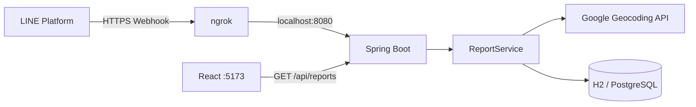

# LINE Messaging API 連携

## 目的

LINE 公式アカウントで受信した不審者情報を Webhook 経由でバックエンドへ取り込み、メッセージを解析してデータベースへ保存する。

この文書は、署名検証を含む現在の実装、接続検証で使用した経路、ローカル接続手順を記載する。接続時の問題の切り分けは [`../operations/troubleshooting.md`](../operations/troubleshooting.md) を参照する。

## 実装と接続検証で使用した経路



| 項目                   | 現在の実装                                      |
| ---------------------- | ----------------------------------------------- |
| Webhook URL            | `POST /line/callback`                           |
| HTTP 受信              | `LineController`                                |
| Webhook 署名検証       | `LineWebhookSignatureVerifier`                  |
| Webhook JSON の解析    | Jackson の `JsonNode`                           |
| メッセージ解析・保存   | `ReportService`                                 |
| 接続検証で使用した経路 | ngrok から Spring Boot の `8080` 番ポートへ転送 |

Controller は Webhook の HTTP 入出力を担当し、署名検証に成功したリクエストからユーザー ID とメッセージ本文を抽出して `ReportService` へ渡す。住所解析、Geocoding、データベースへの保存は Service 層が担当する。

## ローカル接続手順

通常のWebhook確認では `local-h2` Profileを使用する。H2はSpring Bootプロセス内で動作するため、PostgreSQLコンテナの起動は不要である。

1. Spring Boot を `local-h2` Profileで `localhost:8080` に起動する。
2. ngrok で `8080` 番ポートを公開する。
3. LINE Developers に ngrok の HTTPS URL を設定する。

```bash
cd backend
SPRING_PROFILES_ACTIVE=local-h2 ./mvnw spring-boot:run
```

Entity、Repository、DB制約などを変更した場合はPostgreSQLコンテナを起動し、同じ経路を `local-postgres` Profileでも確認する。

```bash
cd backend
SPRING_PROFILES_ACTIVE=local-postgres ./mvnw spring-boot:run
```

データベースとDockerコンテナの詳細は [`../development/database.md`](../development/database.md) を参照する。

別のターミナルで ngrok を起動する。

```bash
ngrok http 8080
```

LINE Developers の Webhook URL には、ngrok が発行したホスト名とバックエンドのパスを組み合わせて設定する。

```text
https://YOUR_NGROK_HOST/line/callback
```

ngrok の転送先は React の `5173` 番ポートではない。React は画面表示と REST API の呼び出しを担当し、LINE Platform からの Webhook は Spring Boot が直接受信する。

## LINE Bot SDK から明示的な Controller へ変更した経緯

開発当初は、LINE Bot SDK の `@LineMessageHandler` と `@EventMapping` を使った自動受付を試した。しかし、当時の環境では想定していた `/callback` のマッピングを確認できず、依存関係や自動設定も含めた原因の切り分けが難しかった。

このため、Webhook の入口と処理経路を明確にする目的で、アプリケーション側に Controller を明示する構成へ変更した。現在の `LineController` は、クラス単位の `/line` とメソッド単位の `/callback` を組み合わせているため、実際の受信先は `POST /line/callback` になる。

```java
@RestController
@RequestMapping("/line")
public class LineController {

    @PostMapping("/callback")
    public ResponseEntity<String> callback(
            @RequestBody String body,
            @RequestHeader(value = "X-Line-Signature", required = false) String signature) {
        // 未解析の本文で署名を検証してから Webhook を処理する
    }
}
```

現在の処理経路は次のとおりである。

```text
POST /line/callback
    ↓
X-Line-Signature と未解析の本文を検証
    ↓
Jackson の JsonNode で JSON を解析
    ↓
ReportService でメッセージを解析
    ↓
Geocoding
    ↓
データベースへ保存
```

明示的な Controller にしたことで、URL のマッピング、署名検証、JSON の解析箇所をアプリケーションコード上で確認できる。署名検証は、受信した本文を解析・整形する前に実行する。

`pom.xml` は LINE Bot SDK 全体の Spring Boot 連携ではなく、署名検証に必要な `line-bot-parser` だけへ依存する。Webhook の受付と JSON 解析は、引き続き明示的な Controller と Jackson が担当する。

## Webhook 署名検証

`LineWebhookSignatureVerifier` は、設定されたチャネルシークレット、未解析のリクエスト本文、`X-Line-Signature` を LINE Bot SDK の検証処理へ渡す。署名がない、Base64 として不正、または計算結果と一致しない場合、Controller は `400 Bad Request` を返し、JSON 解析と保存処理を実行しない。

実装と運用では、次を守る。

- チャネルシークレットは `line.bot.channelSecret` として外部設定し、リポジトリへ保存しない
- 署名、リクエスト本文、LINE ユーザー ID をログへ出力しない
- 受信したリクエスト本文を解析・整形する前に署名を検証する
- 正常な署名、署名なし、不正署名、本文改ざんを自動テストで確認する

公式仕様は [Verify webhook signature](https://developers.line.biz/en/docs/messaging-api/verify-webhook-signature/) を参照する。

## 関連ファイル

- [`../../backend/src/main/java/suspiciouspersonmap/controller/LineController.java`](../../backend/src/main/java/suspiciouspersonmap/controller/LineController.java)
- [`../../backend/src/main/java/suspiciouspersonmap/service/LineWebhookSignatureVerifier.java`](../../backend/src/main/java/suspiciouspersonmap/service/LineWebhookSignatureVerifier.java)
- [`../../backend/src/main/java/suspiciouspersonmap/service/ReportService.java`](../../backend/src/main/java/suspiciouspersonmap/service/ReportService.java)
- [`../../backend/pom.xml`](../../backend/pom.xml)
- [`../operations/troubleshooting.md`](../operations/troubleshooting.md)
